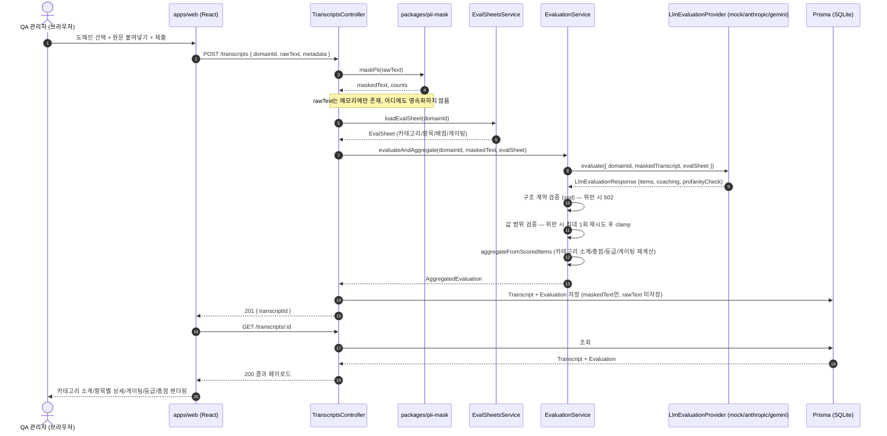
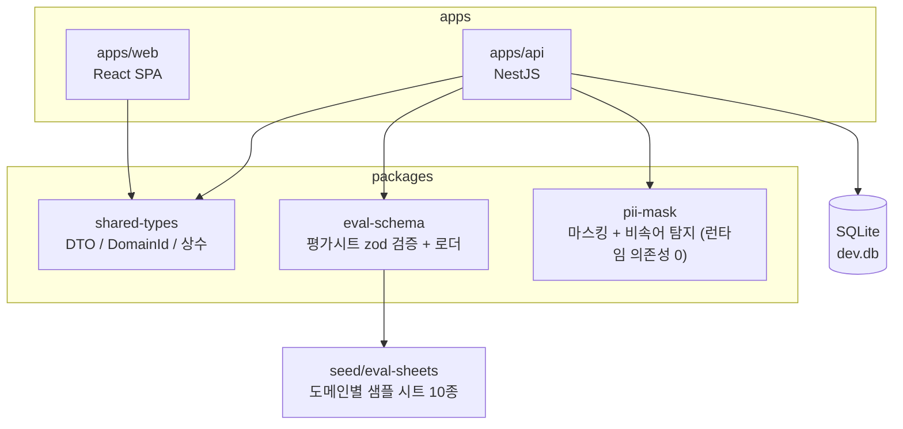

# Auto QA 시스템 아키텍처 개요

- 관련 문서: `CLAUDE.md`, `docs/architecture/eval-sheet-schema.md`, `docs/requirements/phase1-vertical-slice.md`, `docs/requirements/phase3-pii-hardening.md`
- 기준 시점: Phase 1(통신 도메인 Vertical Slice, FR-11로 10개 도메인 확장) 완료·커밋(`fcf6cb1`, `d5ea15f`) 이후. Phase 3(PII 마스킹 강화) 요구사항 확정 시점.
- 목적: 신규 참여자나 서브에이전트가 코드를 처음부터 읽지 않고도 시스템 구조·데이터 흐름·모듈 경계를 파악할 수 있도록 한다.

---

## 1. 모노레포 구조

| 경로                    | 역할                                                                      | 주요 기술                  |
| ----------------------- | ------------------------------------------------------------------------- | -------------------------- |
| `apps/web`              | 트랜스크립트 입력/결과 화면                                               | React, Vite                |
| `apps/api`              | ingestion / evaluation / eval-sheets 모듈                                 | NestJS, Prisma(SQLite)     |
| `packages/shared-types` | FE/BE 공유 DTO, 도메인 ID, 상수                                           | TypeScript                 |
| `packages/eval-schema`  | 평가시트 JSON Schema, zod 검증, seed 로더                                 | zod                        |
| `packages/pii-mask`     | 한국형 PII 마스킹 + 비속어 탐지                                           | 순수 함수, 런타임 의존성 0 |
| `seed/eval-sheets`      | 도메인별 샘플 평가시트(JSON) 10종                                         | -                          |
| `infra`                 | Docker Compose, Dockerfile (Phase 6 예정)                                 | -                          |
| `docs`                  | requirements / design / architecture / review / test / deploy / decisions | Markdown                   |

---

## 2. 요청 처리 흐름 (신규 트랜스크립트 채점)

아래는 `POST /transcripts` 요청 한 건이 처리되는 전체 경로다. PII 마스킹은 LLM 호출 이전에, 서버 측 재계산은 LLM 응답 수신 이후에 일어난다는 순서가 핵심이다(`CLAUDE.md` NFR-5.1, NFR-1.2).

PNG: `system-overview-request-flow.png`

---

## 3. 패키지 의존 관계

PNG: `system-overview-package-deps.png`

`pii-mask`는 마스킹 이전의 원문이 통과하는 유일한 패키지이므로 런타임 의존성 0개를 정책으로 유지한다(`docs/requirements/phase3-pii-hardening.md` §5.2).

---

## 4. API 엔드포인트

| 메서드 | 경로                             | 컨트롤러                | 설명                                                          |
| ------ | -------------------------------- | ----------------------- | ------------------------------------------------------------- |
| POST   | `/transcripts`                   | `TranscriptsController` | 트랜스크립트 제출 → 마스킹 → 채점 → 저장, `transcriptId` 반환 |
| GET    | `/transcripts/:id`               | `TranscriptsController` | 트랜스크립트 + 평가 결과 조회                                 |
| GET    | `/evaluations/:id`               | `EvaluationsController` | 평가 결과 단독 조회                                           |
| PATCH  | `/evaluations/:id/items/:itemId` | `EvaluationsController` | 항목 점수 수동 보정(Override), 서버가 총점/등급/게이팅 재계산 |

---

## 5. 데이터 모델 (Prisma, SQLite)

| 모델         | 필드                                                                                                                                                                                                                                                                                  | 설명                                                                                                                                                        |
| ------------ | ------------------------------------------------------------------------------------------------------------------------------------------------------------------------------------------------------------------------------------------------------------------------------------- | ----------------------------------------------------------------------------------------------------------------------------------------------------------- |
| `Transcript` | `id`, `domainId`, `maskedText`, `metadata?`, `createdAt`                                                                                                                                                                                                                              | `rawText`는 어떤 필드에도 저장하지 않는다(NFR-1.1)                                                                                                          |
| `Evaluation` | `id`, `transcriptId`, `domainId`, `evalSheetVersion`, `llmProvider`, `llmModel`, `status`, `items`, `categoryScores`, `totalScore`, `totalMaxScore`, `grade`, `gatingResult`, `failedGatingItems`, `goodPoints`, `improvements`, `profanityDetected`, `profanityMatches`, `createdAt` | `items`/`categoryScores`/`failedGatingItems`/`goodPoints`/`improvements`/`profanityMatches`는 JSON 직렬화된 문자열로 저장(SQLite에 네이티브 Json 타입 없음) |

`status`는 `completed` 또는 `manual_review`(값 범위 위반 재시도 실패 후 clamp)이다.

---

## 6. 지원 도메인 (10종, FR-11)

| #   | domainId               | 표시명                     |
| --- | ---------------------- | -------------------------- |
| 01  | `finance-banking-card` | 금융(은행·카드)            |
| 02  | `insurance`            | 보험                       |
| 03  | `telecom`              | 통신(이동통신·인터넷)      |
| 04  | `ecommerce-retail`     | 이커머스·유통              |
| 05  | `public-service`       | 공공기관·민원센터          |
| 06  | `healthcare`           | 의료·헬스케어              |
| 07  | `it-support`           | IT·SW 기술지원(헬프데스크) |
| 08  | `travel-lodging`       | 여행·숙박 예약센터         |
| 09  | `delivery-o2o`         | 배달·O2O                   |
| 10  | `utility`              | 유틸리티(전기·가스)        |

10개 도메인 모두 공통 카테고리 구성(기본응대/상담태도/상담전문성/처리효율/컴플라이언스)을 공유하되, 항목 수·배점·게이팅 항목은 도메인마다 다를 수 있다(FR-11.3).

---

## 7. LLM Provider 추상화

| 구현체                           | 파일                                                               | 상태                                                              |
| -------------------------------- | ------------------------------------------------------------------ | ----------------------------------------------------------------- |
| `MockLlmEvaluationProvider`      | `apps/api/src/evaluation/llm/mock-llm-evaluation.provider.ts`      | 기본값(`LLM_PROVIDER=mock`), 결정론적 더미 채점                   |
| `AnthropicLlmEvaluationProvider` | `apps/api/src/evaluation/llm/anthropic-llm-evaluation.provider.ts` | `claude-sonnet-5`(env `ANTHROPIC_MODEL`) — 실제 키 연동은 Phase 4 |
| `GeminiLlmEvaluationProvider`    | `apps/api/src/evaluation/llm/gemini-llm-evaluation.provider.ts`    | Google AI Studio 키 확보 후 연동 예정                             |

세 구현체 모두 `LlmEvaluationProvider.evaluate()` 단일 인터페이스를 따르며, 동일한 구조화 출력 계약(`schema-builder.ts`의 zod 스키마)을 만족해야 한다.

---

## 8. Phase 진행 현황

| Phase | 내용                                                               | 상태                                        |
| ----- | ------------------------------------------------------------------ | ------------------------------------------- |
| 0     | Bootstrap                                                          | 완료                                        |
| 1     | Vertical Slice(통신 도메인, Mock LLM) — FR-11로 10개 도메인 선반영 | 완료·커밋·배포 확인                         |
| 2     | Multi-domain                                                       | Phase 1 FR-11로 선반영되어 별도 작업 불필요 |
| 3     | PII 마스킹 강화                                                    | 요구사항·UI설계 확정, 구현 착수 대기        |
| 4     | 실제 평가시트 반입                                                 | 미착수                                      |
| 5     | 테스트 자동화 확장                                                 | 부분 미착수 (`apps/web` 테스트 러너 없음)   |
| 6     | CI/배포                                                            | 미착수 (Docker/CI 인프라 없음)              |

---

## 9. 핵심 설계 원칙 요약

- **원문 비저장**: `rawText`는 마스킹 후 즉시 폐기하고 `maskedText`만 LLM 전송·DB 저장에 사용한다.
- **서버 재계산**: LLM이 반환한 총점을 그대로 신뢰하지 않고 서버가 항상 항목 점수 합을 재계산한다(`EvaluationService.aggregateFromScoredItems`).
- **구조/값 검증 분리**: 구조적 계약 위반(항목 누락·coaching/profanityCheck 형식 위반)은 502 즉시 거부, 값 범위 위반(점수 초과·비정수 등)은 최대 1회 재시도 후 안전하게 보정(`manual_review`).
- **Provider 추상화**: mock/anthropic/gemini를 동일 인터페이스로 교체 가능하게 하여 실제 API 키 없이도 전체 파이프라인을 개발·검증한다.
- **PII 패키지 의존성 0**: `packages/pii-mask`는 마스킹 이전 원문이 통과하므로 공급망 보안을 위해 런타임 의존성을 두지 않는다.
