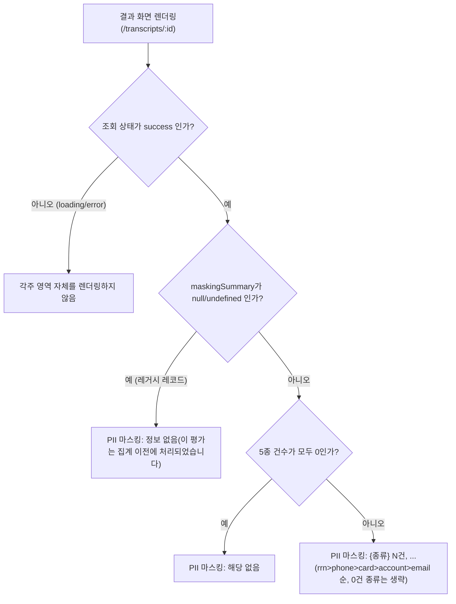

# Phase 3 — PII 마스킹 강화: FR-4(마스킹 관측성) 경량 UI 스펙

- 관련 문서: `docs/requirements/phase3-pii-hardening.md`(§3 FR-4, §4.4, §7 AC-F4, §10 PM 결정 기록), `docs/design/phase1-vertical-slice-ui-spec.md`(기존 결과 화면 전체 설계)
- 산출물 소비자: `backend-implementer`(데이터 계약 확인용), `frontend-implementer`
- 범위: **`/transcripts/:id` 결과 화면의 메타 정보 영역에 한 줄 추가.** 그 외 화면(`/transcripts/new`, `/transcripts`, `/admin/eval-sheets`) 변경 없음, 신규 컴포넌트 없음, 레이아웃 재설계 없음.
- 코드(React 컴포넌트 등)는 포함하지 않는다. 배치/문구/상태/데이터 계약만 정의한다.

---

## 1. 변경 대상 및 재사용 컴포넌트

기존 코드(`apps/web/src/components/EvaluationMetaFooter.tsx`, `apps/web/src/pages/TranscriptResultPage.tsx`)를 확인한 결과:

- `EvaluationMetaFooter`가 이미 결과 화면 최하단에 렌더링되며, `sourceCitation` → `disclaimer` → `평가시트 v{ver} · Provider: {provider} ({model})` 순으로 담담한 톤의 각주 텍스트(`.footnote-text` 클래스, 작은 글씨·무채색)를 출력하고 있다.
- 이 컴포넌트는 Phase 1 설계서(§3.2)에서 정의한 "부가정보(출처/디스클레이머/메타)" 영역과 정확히 일치하며, PII 마스킹 요약도 성격상 "이 평가가 어떻게 처리되었는가"를 알려주는 시스템 메타 정보이므로 **새 컴포넌트를 만들지 않고 `EvaluationMetaFooter`를 확장**한다.

**결정: `EvaluationMetaFooter`에 `maskingSummary?: Record<PiiKind, number> | null` prop을 추가한다.** 새 컴포넌트(`PiiMaskingSummaryLine` 등)를 굳이 분리할 필요는 없지만, 문구 생성 로직(§2)이 조건 분기가 있으므로 순수 함수 하나(`formatMaskingSummary(summary): string`)로 분리해 테스트 가능하게 하는 것을 권장한다(선택, frontend-implementer 재량).

**배치 위치**: 각주 블록(`footnote-block`) 내부, **`disclaimer` 줄 다음, `평가시트 버전/Provider` 줄 이전.** 즉 "이 결과에 대한 고지/근거성 정보(출처·디스클레이머·PII 처리 현황)"를 먼저 묶고, "이 결과를 생성한 시스템 정보(평가시트 버전·LLM Provider)"를 마지막에 배치하는 기존 순서 원칙을 유지한다.

```
footnote-block
├─ (있으면) 출처(컴플라이언스 근거): ...
├─ (있으면) ※ {disclaimer}
├─ (신규) PII 마스킹: ...          ← 이번 변경
└─ 평가시트 v{ver} · Provider: {provider} ({model})
```

---

## 2. 표시 규칙 (FR-4.3, AC-F4)

### 2.1 종류별 표시 순서 — 고정

탐지 종류가 여러 개일 때 항상 다음 고정 순서로 나열한다(값이 아닌 종류 자체의 우선순위이며, 매 렌더마다 동일해야 함 — 임의 정렬 금지):

```
rrn(주민등록번호) > phone(전화번호) > card(카드번호) > account(계좌번호) > email(이메일)
```

근거: `packages/pii-mask`의 `PiiKind` 정의 순서 및 심각도(주민등록번호가 가장 민감) 기준. 백엔드가 응답으로 내려주는 `maskingSummary` 객체의 키 순서에 의존하지 않고, **프론트에서 이 고정 배열 순서로 순회**하여 문구를 조립한다(JS 객체 키 순서에 암묵적으로 의존하지 않기 위함).

### 2.2 구분자

각 종류 표기는 `"{라벨} {건수}건"` 형식이며, 종류 간에는 쉼표+공백(`, `)으로 연결한다.

- 예: `PII 마스킹: 전화번호 2건, 이메일 1건`
- 예(3종 이상): `PII 마스킹: 주민등록번호 1건, 전화번호 1건, 카드번호 1건`

### 2.3 0건 종류는 나열하지 않음

`counts`에서 값이 0인 종류는 목록에서 제외한다. 5종 모두 0이면 개별 나열 대신 아래 고정 문구 하나만 표시한다.

```
PII 마스킹: 해당 없음
```

### 2.4 라벨 매핑 (고정, 하드코딩 상수)

| `PiiKind` 값 | 표시 라벨    |
| ------------ | ------------ |
| `rrn`        | 주민등록번호 |
| `phone`      | 전화번호     |
| `card`       | 카드번호     |
| `account`    | 계좌번호     |
| `email`      | 이메일       |

### 2.5 AC-F4 검증 예시

- 입력: `{ rrn: 0, phone: 1, card: 0, account: 0, email: 1 }`
- 출력: `PII 마스킹: 전화번호 1건, 이메일 1건`

---

## 3. 타이포그래피 / 톤

- **경고 배지가 아니다.** `ProfanityBadge`(빨강 아이콘 + "욕설·비속어 탐지됨" + 클릭 가능한 토글 패널)와는 시각적 위계가 완전히 달라야 한다. PII 마스킹 요약은 다음 원칙을 따른다.
  - 아이콘 없음(경고/성공 아이콘 부착 금지). 이 정보는 "정상적으로 처리되었음을 알리는 담담한 로그성 정보"이지, 사용자가 조치를 취해야 하는 경고가 아니다.
  - 배경색·테두리 강조 없음. `EvaluationMetaFooter`의 기존 각주와 동일한 스타일(`footnote-text` 클래스: 작은 글씨, 낮은 명도의 본문 텍스트 색)을 그대로 사용한다.
  - 클릭 가능한 토글/펼치기 요소를 만들지 않는다(원문 조각을 보여줄 것이 전혀 없으므로 펼칠 내용도 없다 — §5.4 참조).
  - "탐지 0건"과 "탐지 있음"을 색상으로 구분하지 않는다(둘 다 동일한 무채색 텍스트). 값의 차이는 텍스트 내용 자체로만 전달한다.

---

## 4. 접근성

- 별도의 `aria-live`, `role="alert"` 등을 지정하지 않는다 — 이 줄은 페이지 최초 렌더 시 정적으로 함께 나타나는 정보이며, 사용자의 즉각적 주의를 요구하는 사건성 정보가 아니다(§3, 게이팅 배너와 대비되는 지점).
- 텍스트 자체가 이미 "PII 마스킹: 전화번호 1건, 이메일 1건"처럼 완결된 문장이므로 스크린리더가 그대로 읽어도 의미가 전달된다. 별도의 `aria-label`/숨김 텍스트를 추가할 필요는 없다.
- 아이콘을 사용하지 않으므로(§3) 아이콘 관련 `aria-hidden` 이슈도 발생하지 않는다.
- 다른 각주 줄과 동일하게 일반 텍스트 흐름에 포함되어 키보드 포커스 이동 대상이 아니다(인터랙션 요소가 아니므로 `tabIndex` 불필요).

---

## 5. 상태별 동작



PNG: `phase3-pii-hardening-ui-spec-masking-summary-render.png`

### 5.1 정상 (counts 존재, 1건 이상 탐지)

`maskingSummary`가 5종 키를 모두 포함한 객체이고 하나 이상 값이 0보다 클 때 — §2 규칙대로 조립한 문구를 표시한다.

### 5.2 정상 (counts 존재, 전부 0)

`PII 마스킹: 해당 없음` 표시.

### 5.3 레거시 레코드 — `maskingSummary`가 `null` 또는 `undefined`

Phase 3 이전에 저장된 레코드는 `maskingSummary`가 계산되지 않았다(요구사항 §9 Out of scope: "기존 저장 데이터 소급 재마스킹 불가" — 원문을 저장하지 않으므로 사후 재계산 자체가 불가능).

**결정: 줄을 숨기지 않고, "해당 없음"과 명확히 구분되는 별도 문구로 표시한다.**

```
PII 마스킹: 정보 없음 (이 평가는 집계 이전에 처리되었습니다)
```

- **줄을 완전히 숨기지 않는 이유**: `null`(정보 없음)과 `counts` 전부 0(탐지 결과 0건 확인됨)은 의미가 다르다. 숨기면 "해당 없음"과 시각적으로 동일하게 인지되어, QA 관리자가 "이 레코드는 PII가 없었다"고 잘못 결론지을 수 있다(실제로는 마스킹이 적용됐을 수도, 안 됐을 수도 있으나 **집계되지 않았을 뿐**). 명시적으로 "정보 없음"을 표시해 두 상태를 구분한다.
- 이 경우도 §3의 톤(무채색, 아이콘 없음)을 유지한다. 결측치를 경고처럼 보이게 하지 않는다.
- 판정 로직: `maskingSummary == null` (즉 `null` 또는 필드 자체 부재)이면 이 분기, 그 외(빈 객체 등 스펙 위반 응답)는 방어적으로 동일하게 "정보 없음"으로 처리한다(잘못된 형태를 "해당 없음"으로 오인시키지 않기 위함).

### 5.4 로딩 / 에러 상태

`EvaluationMetaFooter`(및 이 줄)는 결과 화면의 `success` 상태에서만 렌더링된다(Phase 1 설계서 §2.2, 현재 `TranscriptResultPage`도 `status === 'success'` 블록 내부에서만 `EvaluationMetaFooter`를 렌더링함 — 기존 동작 그대로 유지).

- `loading` 상태: 이 줄을 포함한 각주 블록 전체가 아직 렌더링되지 않는다(스켈레톤도 별도로 만들지 않는다 — 각주는 우선순위가 낮은 정보이므로 전체 페이지 스피너로 충분, Phase 1 관례 유지).
- `not-found` / `error` 상태: 결과 자체가 없으므로 이 줄도 표시되지 않는다.
- 재시도 후 `success`로 전환되면 그때 정상적으로 §5.1~5.3 규칙에 따라 표시된다.

### 5.5 원문 비노출 원칙 (요구사항 §4.1, AC-F4 재확인)

이 줄은 **어떤 경우에도 건수 숫자와 라벨 외의 값을 표시하지 않는다.** 원문 조각, 매칭 위치, 마스킹 전후 문자열 비교, 길이 정보 등은 API 응답에도 포함되지 않아야 하며(백엔드 계약, §6 참조), UI는 이를 표시할 수단 자체를 두지 않는다(펼치기 패널 없음 — §3).

---

## 6. 데이터 계약 (frontend가 기대하는 응답 형태)

```ts
// packages/shared-types — EvaluationResultResponse 확장 (요구사항 §4.4)
type PiiKind = 'rrn' | 'phone' | 'card' | 'account' | 'email';
type MaskingSummary = Record<PiiKind, number>;

interface EvaluationResultResponse {
  // ...기존 필드 유지...
  maskingSummary?: MaskingSummary | null; // 레거시 레코드는 null
}
```

- `EvaluationMetaFooter`에 전달할 prop: `maskingSummary: MaskingSummary | null | undefined` (그대로 API 응답값을 전달, 프론트가 값을 가공/재계산하지 않음 — Phase 1 NFR-5.1 "서버 응답값을 그대로 표시" 원칙 연장).
- `formatMaskingSummary(summary)` 순수 함수 의사코드:

```
function formatMaskingSummary(summary):
  if summary is null or undefined:
    return "PII 마스킹: 정보 없음 (이 평가는 집계 이전에 처리되었습니다)"

  order = [rrn, phone, card, account, email]
  labels = { rrn: "주민등록번호", phone: "전화번호", card: "카드번호",
             account: "계좌번호", email: "이메일" }
  parts = []
  for kind in order:
    count = summary[kind] ?? 0
    if count > 0:
      parts.push(`${labels[kind]} ${count}건`)

  if parts.length == 0:
    return "PII 마스킹: 해당 없음"

  return "PII 마스킹: " + parts.join(", ")
```

---

## 7. 텍스트 와이어프레임 (결과 화면 최하단, Phase 1 §5.2 전체 와이어프레임 중 이 부분만 갱신)

### 7.1 탐지 있음

```
├──────────────────────────────────────────────────────────────────┤
│ 출처(컴플라이언스 근거): 스마트초이스(smartchoice.or.kr) ...          │
│ ※ 배점 및 가중치는 참고용 설계 예시이며[가정] ...                     │
│ PII 마스킹: 전화번호 1건, 이메일 1건                                 │
│ 평가시트 v1.0.0 · Provider: mock (mock-v1)                          │
└──────────────────────────────────────────────────────────────────┘
```

### 7.2 탐지 없음

```
│ PII 마스킹: 해당 없음                                                │
│ 평가시트 v1.0.0 · Provider: mock (mock-v1)                          │
```

### 7.3 레거시 레코드 (`maskingSummary` 없음)

```
│ PII 마스킹: 정보 없음 (이 평가는 집계 이전에 처리되었습니다)          │
│ 평가시트 v1.0.0 · Provider: mock (mock-v1)                          │
```

---

## 8. 반응형

- 별도 고려사항 없음. 다른 각주 줄(`footnote-text`)과 동일하게 한 줄 텍스트이며, 좁은 화면에서는 자동 줄바꿈되어도 무방하다(문장 형태이므로 중간에 끊겨도 의미 손실이 없음). 별도 breakpoint 처리 불필요.

---

## 9. 구현 시 유의사항 요약 (frontend-implementer용)

- 새 컴포넌트를 만들지 말고 `EvaluationMetaFooter`(`apps/web/src/components/EvaluationMetaFooter.tsx`)에 `maskingSummary` prop을 추가하고, `TranscriptResultPage.tsx`의 기존 `<EvaluationMetaFooter ... />` 호출부에 `maskingSummary={result.maskingSummary}`만 추가한다.
- 종류 나열 순서(rrn > phone > card > account > email)는 백엔드 응답 객체의 키 순서에 의존하지 말고 프론트에 고정 배열로 하드코딩한다.
- "해당 없음"(집계 결과 0건 확인)과 "정보 없음"(집계 자체가 없는 레거시 레코드)을 반드시 다른 문구로 구분한다 — 하나로 합치지 않는다(§5.3).
- 아이콘·색상 강조·클릭 토글을 추가하지 않는다 — `ProfanityBadge`와 다른 위계임을 시각적으로 지켜야 한다(§3).
- 원문 조각을 표시할 UI 요소(툴팁, 펼치기 등)를 만들지 않는다 — 애초에 백엔드도 원문을 내려주지 않는다(§5.5).
