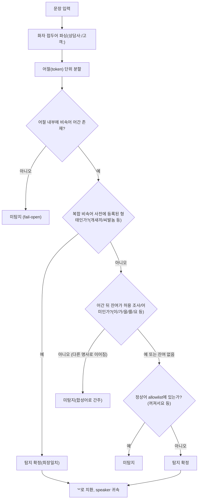

# Phase 3 — PII 마스킹 강화 (PII/비속어 탐지 정확도 고도화) 요구사항

- 관련 문서: `CLAUDE.md` §단계별 전개(Phase 3), `docs/requirements/phase1-vertical-slice.md`(FR-2, FR-8, NFR-1), `docs/review/phase1-vertical-slice-review.md`(L-1, L-2), `docs/review/phase1-vertical-slice-review-round2.md`(M-3, M-4)
- 대상 코드: `packages/pii-mask/src/mask.ts`, `packages/pii-mask/src/profanity.ts`, `packages/pii-mask/src/index.ts`
- 산출물 소비자: `backend-implementer`(주), `test-automation`(회귀 코퍼스), `ui-designer`(§7 조건부 — FR-4 채택 시에만)
- 전제: Phase 1은 완료·커밋·배포됨. Phase 2(다중 도메인)는 Phase 1 FR-11로 선반영됨.

---

## 1. 배경 / 목적

Phase 1의 PII 마스킹(`packages/pii-mask`)은 "정규식 기반 최소 구현"으로 명시적으로 범위를 좁혀 출발했고(`phase1-vertical-slice.md` FR-2.4, NFR-1.3), 두 차례 코드리뷰에서 다음 두 방향의 결함이 확인되어 Phase 3으로 이관되었다.

| 방향                        | 의미                                           | 결과                                                                            | 이관 항목                                              |
| --------------------------- | ---------------------------------------------- | ------------------------------------------------------------------------------- | ------------------------------------------------------ |
| **마스킹 누락 (탐지 실패)** | PII인데 마스킹되지 않음                        | **원문 PII가 LLM으로 전송되고 DB에 영구 저장됨** — 되돌릴 수 없는 개인정보 유출 | L-1(점 구분자 전화번호), L-2(하이픈 없는 주민등록번호) |
| **과탐 (오탐지)**           | PII가 아닌데 마스킹됨 / 비속어가 아닌데 탐지됨 | 채점 근거 훼손, QA 결과 신뢰도 저하 (유출은 아님 — fail-safe 방향)              | M-3(비속어 오탐), M-4(계좌번호 과탐)                   |

**두 방향의 심각도는 대칭이 아니다.** 마스킹 누락은 (a) 원문을 저장하지 않는 정책(NFR-1.1) 때문에 사후 재마스킹으로 복구할 수 없고, (b) 외부 LLM 프로바이더(Phase 4의 anthropic/gemini)로 실제 PII가 송신되는 경로를 만들며, (c) 법적/규제 리스크(개인정보보호법)를 직접 발생시킨다. 반면 과탐은 채점 품질 문제로 국한되며 데이터 유출이 없고, 사후에 규칙을 고쳐 재평가할 수 있다.

따라서 Phase 3의 목적은 **"① 마스킹 누락을 우선 제거하고, ② 그 과정에서 늘어날 수 있는 과탐을 통제 가능한 수준으로 억제하며, ③ Phase 1에서 이미 통과하던 케이스에 회귀를 만들지 않는 것"**이다.

### 1.1 설계 원칙 — 방향별 기본값(default) 분리

| 영역            | 판단이 애매할 때의 기본 동작    | 근거                                                                                                                            |
| --------------- | ------------------------------- | ------------------------------------------------------------------------------------------------------------------------------- |
| **PII 마스킹**  | **마스킹한다 (fail-closed)**    | 누락의 피해(유출, 복구 불가) > 과탐의 피해(근거 훼손, 복구 가능)                                                                |
| **비속어 탐지** | **탐지하지 않는다 (fail-open)** | 오탐 시 QA 결과 화면에 "상담사 비속어 검출" 빨강 배지가 잘못 표시되어 상담사 평가에 직접 피해. 미탐은 코칭 신호 1건 누락에 그침 |

이 비대칭은 Phase 3 전체 규칙 설계의 기준선이며, 규칙 간 충돌이 생길 때 이 원칙으로 판정한다.

### 1.2 우선순위 / 심각도

| 우선순위 | ID   | 항목                                                                    | 심각도     | 방향          |
| -------- | ---- | ----------------------------------------------------------------------- | ---------- | ------------- |
| **P0**   | FR-1 | 마스킹 누락 제거 (전화번호 점 구분자, 무구분 주민번호, 무구분 계좌번호) | **High**   | 유출          |
| **P1**   | FR-3 | 비속어 오탐 근본 해결 (형태소 경계 기반 전환)                           | Medium     | 과탐          |
| **P2**   | FR-2 | 숫자 코드 과탐 억제 (계좌번호/카드번호 판정 정교화)                     | Low~Medium | 과탐          |
| **P2**   | FR-5 | 회귀 방지 테스트 코퍼스 + 테스트 인프라                                 | Medium     | (품질 게이트) |
| **P3**   | FR-4 | 마스킹 결과 관측성(counts 활용) — **선택 채택**                         | Low        | (운영성)      |

P1이 P2보다 앞서는 이유: 비속어 오탐은 결과 화면에 즉시 노출되어 **상담사 개인 평가에 직접 영향**을 주며(리뷰 M-3: "통신/IT 상담 빈출 표현인 '화면이 꺼져서요'가 상담사 비속어로 오판"), 사용자 입력만으로 현재 재현 가능하다. 계좌번호 과탐은 LLM 채점 근거가 약간 훼손되는 수준에 그친다.

---

## 2. 사용자 시나리오

Phase 3은 사용자에게 새 기능을 제공하지 않는다. 아래는 **기존 시나리오에서 결함이 드러나는 지점**과 개선 후 기대 동작이다.

### S-1. (유출) 상담사가 점 구분자로 전화번호를 받아적은 상담 — QA 관리자 관점
1. 상담 메모에 `연락처는 010.1234.5678 이라고 하셨습니다`가 포함된 트랜스크립트를 제출한다.
2. **현재**: `010.1234.5678`이 그대로 마스킹 없이 LLM에 전송되고 `maskedText`로 DB에 저장된다. QA 관리자는 이를 인지할 방법이 없다.
3. **개선 후**: `[전화번호]`로 치환되어 저장·전송된다.

### S-2. (유출) 하이픈 없이 주민등록번호를 받아적은 상담
1. `본인확인 위해 9001011234567 확인했습니다` 트랜스크립트를 제출한다.
2. **현재**: 13자리 연속 숫자가 어떤 규칙에도 걸리지 않아 원문 그대로 저장된다.
3. **개선 후**: `[주민등록번호]`로 치환된다.

### S-3. (과탐) 통신 상담에서 기기 상태를 설명한 상담사 — 상담사 관점
1. 상담사가 `화면이 꺼져서요`, `불이 꺼져 있어요`라고 안내한 상담이 채점된다.
2. **현재**: 결과 화면에 빨강 비속어 배지 + "상담사 비속어 검출"이 표시된다. 상담사는 자신이 욕설을 했다는 잘못된 평가를 받는다.
3. **개선 후**: 초록 배지(미탐지)로 표시된다. 동시에 실제 욕설(`저리 꺼져!`)은 여전히 탐지된다.

### S-4. (과탐) 상품코드/요금코드를 안내한 상담
1. `상품코드 123-456-789 로 변경해 드리겠습니다` 트랜스크립트를 제출한다.
2. **현재**: `상품코드 [계좌번호] 로 ...`로 마스킹되어, LLM이 "상담사가 상품코드를 정확히 안내했는가" 항목을 판단할 근거를 잃는다.
3. **개선 후**: 원문이 보존되고, 실제 계좌번호(`110-123-456789` 등)는 계속 마스킹된다.

### 예외 시나리오
- **빈 문자열 / 공백만 입력**: 마스킹·비속어 탐지 모두 예외 없이 빈 결과를 반환한다(상위 계층의 길이 검증은 Phase 1 FR-1.2가 담당).
- **PII가 전혀 없는 정상 문장**: 어떤 placeholder도 삽입되지 않는다(과탐 0건).
- **초장문 트랜스크립트(수십 KB)**: 정규식 백트래킹으로 인한 응답 지연/행(hang)이 발생하지 않는다(NFR-3).
- **PII 후보가 문장 경계/문장부호에 붙어 있는 경우**(`연락처:010.1234.5678입니다.`): 구분자·조사·문장부호가 붙어도 탐지되어야 한다.

---

## 3. 기능 요구사항 (FR)

### FR-1. 마스킹 누락 제거 — **P0 / High (PII 유출 방향)**

> 원칙: 이 절의 요구사항은 **fail-closed**. 판정이 애매하면 마스킹한다. 이로 인해 발생하는 과탐은 FR-2보다 우선순위가 낮은 문제로 취급한다.

- **FR-1.1 전화번호 구분자 확장 (L-1)**
  - 휴대전화(`01[016789]`)·유선전화(`02`, `0[3-6][1-9]`) 모두에서 그룹 구분자로 최소 다음을 허용한다: 하이픈(`-`), 점(`.`), 공백(1개 이상), 구분자 없음.
  - 동일 번호 내에서 구분자가 혼용된 경우(`010.1234-5678`)도 탐지한다.
  - 괄호 지역번호 표기(`(02)123-4567`), 국가번호 표기(`+82-10-1234-5678`, `+82 10 1234 5678`)도 탐지 대상에 포함한다.
  - **제약**: 점(`.`) 구분자는 **전화번호·카드번호 규칙에만** 허용한다. 계좌번호·주민등록번호 규칙에 점 구분자를 도입하면 IP 주소·버전 문자열·소수점 금액(`12.34.56`, `1.2.3`)에서 대량 과탐이 발생하므로 금지한다.

- **FR-1.2 하이픈 없는 주민등록번호 (L-2)**
  - 구분자 없는 13자리 연속 숫자를 주민등록번호 후보로 판정한다.
  - 과탐 억제를 위해 다음 조건을 **모두** 만족할 때만 마스킹한다:
    1. 앞 6자리가 유효한 날짜 형식(월 `01`~`12`, 일 `01`~`31`),
    2. 7번째 자리(성별·세기 코드)가 `1`~`8`.
  - 주민등록번호 검증 체크섬(모듈러 11)은 **마스킹 여부 판정에 사용하지 않는다**. STT 오인식·오타로 체크섬이 깨진 실제 주민번호가 마스킹되지 않는 미탐(유출 방향) 위험이 과탐 감소 이익보다 크기 때문이다(§1.1 fail-closed).
  - 기존 하이픈/공백 구분 규칙(`900101-1234567`)은 그대로 유지한다. 점 구분자는 FR-1.1 제약에 따라 도입하지 않는다.

- **FR-1.3 카드번호 구분자 확장**
  - 4-4-4-4 그룹 구분자에 점(`.`)을 추가한다(`1234.5678.9012.3456`).
  - 15자리 카드(AMEX, 4-6-5 그룹)는 이번 범위에 포함하되, 구분자가 있는 형태만 대상으로 한다.

- **FR-1.4 하이픈 없는 계좌번호 (신규 — Phase 3 분석 중 식별)**
  - 현재 계좌번호 규칙은 하이픈으로 구분된 형태만 탐지하므로, `계좌번호 1101234567890` 같은 무구분 표기는 **마스킹되지 않고 저장된다**(유출 방향 결함). 이를 해소한다.
  - 과탐 억제를 위해 **문맥 키워드 근접 조건**을 요구한다: 후보 숫자열 앞 15자 이내에 계좌 관련 키워드(`계좌`, `통장`, `입금`, `이체`, `송금`, `환불계좌`, `예금주`, 주요 은행명 등)가 존재하고, 숫자열 길이가 10~16자리일 때 마스킹한다.
  - 키워드 목록은 코드가 아닌 데이터(상수 배열/JSON)로 분리하여 확장 가능하게 한다(FR-6.2).

- **FR-1.5 마스킹 규칙 적용 순서 불변식**
  - 규칙 추가로 규칙 간 상호 간섭이 발생하지 않아야 한다. 최소한 다음 불변식을 보장한다:
    1. 어떤 규칙도 이미 삽입된 placeholder(`[전화번호]` 등) 내부/주변을 재매칭하지 않는다.
    2. 긴 숫자열이 짧은 규칙에 의해 **부분 매칭되어 쪼개지지 않는다**(예: 16자리 카드번호가 `[주민등록번호]` + 잔여 3자리로 분해되면 안 됨). 숫자열 좌우에 숫자 경계 가드를 둔다.
    3. 한 입력에 대해 규칙 적용 순서가 달라져도 결과가 달라지지 않도록, 순서 의존성이 있는 규칙 쌍은 코드 주석으로 이유를 명시한다.
  - **설계 권고(구현 재량)**: 규칙 수가 늘어날수록 "정규식 나열 + 순서 의존"은 유지보수 비용이 급증한다. `숫자열 토큰 추출 → 길이/구분자/문맥 기반 분류 → 치환`의 2단계 구조로 리팩터링하는 것을 권고한다. 이 경우 FR-1.5의 불변식이 구조적으로 보장된다. 단, 이는 **권고이며 필수가 아니다** — 최종 판정 기준은 §6의 AC 통과 여부다.

### FR-2. 숫자 코드 과탐 억제 — **P2 / Low~Medium (과탐 방향)**

- **FR-2.1 계좌번호 최소 자릿수 기준 (M-4)**
  - 하이픈 구분 숫자 그룹을 계좌번호로 판정하려면 **구분자를 제외한 총 숫자 자릿수가 10자리 이상**이어야 한다.
  - 근거: 국내 은행 계좌번호는 통상 10~14자리다. 이 기준만으로 리뷰에서 지적된 `상품코드 123-456-789`(9자리), `요금 12-34-56`(6자리)이 자연히 제외된다.
  - FR-1.4의 문맥 키워드가 근접해 있으면 임계를 8자리로 완화한다(fail-closed 보정).

- **FR-2.2 무구분 카드번호에 Luhn 검사 적용 (M-4)**
  - 구분자 **없는** 16자리 연속 숫자는 Luhn 체크섬을 통과할 때만 `[카드번호]`로 마스킹한다.
  - 근거: 리뷰에서 지적된 `고객번호 0212345678901234`는 Luhn 검사에서 탈락하여 과탐이 해소된다. 무작위 16자리가 Luhn을 우연히 통과할 확률은 약 10%이므로 과탐이 크게 줄어든다.
  - **반대로, 구분자가 있는 4-4-4-4 형태(`1234-5678-9012-3456`)는 Luhn 통과 여부와 무관하게 마스킹한다.** 구분자 형식 자체가 카드번호라는 강한 신호이고, 오타/STT 오인식으로 체크섬이 깨진 실제 카드번호를 놓치는 미탐(유출)이 더 심각하기 때문이다(§1.1).
  - Luhn 검사 결과는 마스킹 여부 판정에만 쓰고, 카드번호 값 자체나 그 일부를 로그·에러 메시지에 남기지 않는다.

- **FR-2.3 날짜/주문번호 예외 유지**
  - Phase 1에서 이미 해소된 날짜(`2026-09-11`), 주문번호(`20260911-0012-77`), 유선전화(`032-1234-5678`, `02-123-4567`) 케이스는 **회귀 없이 유지**되어야 한다(§6 AC-R).

### FR-3. 비속어 탐지 방식 전환 — **P1 / Medium (과탐 방향)**

> 방식 선택에 대한 트레이드오프 분석과 권고는 §5에 별도로 기술한다. 이 절은 **권고안(옵션 B: 자체 규칙 기반 어절/형태소 경계 판정, 외부 의존성 없음)** 채택을 전제로 한 요구사항이다.



PNG: `phase3-pii-hardening-profanity-flow.png`

- **FR-3.1 판정 단위를 문자열 부분일치에서 어절(token) 단위로 전환한다.**
  - 입력 문장을 공백·문장부호 기준으로 어절로 분할한 뒤, 각 어절 내부에서 비속어 어간을 탐색한다.
  - 현재의 "문장 전체에 대한 부분 문자열 매칭 + 접미어 블랙리스트(negative lookahead/lookbehind)" 방식은 폐기한다.

- **FR-3.2 어간 + 허용 조사/어미 결합만 비속어로 판정한다.**
  - 비속어 어간 뒤에 남는 잔여 문자열이 **허용 조사/어미 목록**(예: 이/가/은/는/을/를/도/만/의/에/야/아/요/네/지/다/서/고/네요/입니다 등)에 속하거나 잔여가 없을 때만 비속어로 확정한다.
  - 잔여 문자열이 허용 목록에 없는 **한글 형태소**로 이어지면 합성어로 보고 **탐지하지 않는다**(fail-open 기본값, §1.1).
    - 이 규칙만으로 `시발점`, `시발역`, `시발택시`, `새끼손가락`, `새끼발가락`, `새끼고양이`, `병신년(丙申年)`이 접미어 블랙리스트 없이 자동 제외된다.
  - 어간 **앞**에 다른 한글 형태소가 붙어 있는 경우도 동일 원칙을 적용한다(`강아지새끼`는 미탐지). 단, FR-3.3의 복합 비속어 사전에 등록된 형태는 예외로 탐지한다.

- **FR-3.3 복합 비속어 사전으로 미탐을 보완한다.**
  - FR-3.2의 fail-open 기본값 때문에 실제 비속어 합성형(`씨발놈`, `씨발년`, `개새끼`, `개자식`, `미친놈`, `미친년` 등)이 미탐될 수 있다. 이를 막기 위해 **복합 비속어를 어절 단위 사전에 명시적으로 등록**한다.
  - 어간 + 비속어성 접미어(`놈`, `년`, `새끼`, `것`, `자식` 등) 결합은 사전 등록 또는 별도 접미어 허용 규칙으로 탐지 대상에 포함한다.
  - 최장일치(longest match) 원칙을 적용한다(`개새끼`가 `새끼`보다 우선).

- **FR-3.4 정상어 예외는 "어절 전체 일치 allowlist"로 관리한다.**
  - FR-3.2로도 걸러지지 않는 잔여 오탐(예: 어미 결합형과 형태가 겹치는 정상 표현)은 **접미어 블랙리스트가 아니라 정상 어절 allowlist**로 처리한다.
  - 리뷰에서 확인된 `꺼져서요`, `꺼져 있어요`, `꺼져버렸어요`처럼 통신/IT 상담 빈출 표현은 FR-3.2의 어미 판정으로 처리하는 것이 원칙이나, 어미 목록만으로 불충분하면 allowlist에 등록한다.
  - **`꺼져` 어간 취급 정책**: `꺼져`는 정상 동사 "꺼지다"(전원/화면이 꺼지다)의 활용형과 명령형 욕설이 동형이다. 통신/IT 도메인에서 정상 용법이 압도적으로 흔하므로, **어간 단독(`꺼져`, `꺼져!`) 또는 명령형 맥락(`저리 꺼져`, `꺼져라`)에서만 탐지**하고 그 외 활용형(`꺼져서`, `꺼져요`, `꺼져 있`, `꺼져버렸`)은 탐지하지 않는다. 이 판정이 규칙으로 안정적으로 구현되지 않을 경우, **`꺼져`를 사전에서 제외하는 것을 허용한다**(미탐 1건 < 오탐 다수, §1.1 fail-open).

- **FR-3.5 화자 귀속 및 출력 규칙은 Phase 1 동작을 그대로 유지한다.**
  - `상담사:`/`고객:` 접두어 파싱, 미표기 줄의 직전 화자 귀속, 최초 화자 없으면 `agent`, 화자 접두어 제거 후 순수 발화만 반환 — 전부 회귀 금지.
  - 탐지된 비속어 단어 자체는 응답·저장·로그 어디에도 원문으로 남기지 않고 `*`로 치환한다(Phase 1 FR-8.3 유지).
  - **권고(선택)**: `mask.ts`는 "길이 정보 등 원문 유추 단서를 남기지 않는다"는 정책을 따르는데 `profanity.ts`는 `'*'.repeat(word.length)`로 길이를 노출한다. 일관성을 위해 고정 길이 마스크(`***`)로 변경하는 것을 권고한다. 채택 시 UI는 코드 변경 없이 동작한다(문자열 내용만 변함).
  - **addendum(PM 요청, 2026-09-13)**: `matches[].maskedText`의 출력 단위를 줄(화자 턴) 전체 → 문장(비속어가 포함된 문장만)으로 변경함. 화자 귀속(`parseSpeakerLines`, 접두어 파싱, 미표기 줄의 직전 화자 귀속)은 이번 변경의 대상이 아니며 그대로 유지된다 — 변경 대상은 화자 귀속 이후 "그 발화를 어느 단위로 잘라 반환하느냐"이다. 한 줄(발화) 안에 여러 문장이 섞여 있을 때, 비속어가 포함되지 않은 문장은 결과에서 제외하고 비속어가 포함된 문장만 반환한다(문장 경계는 `. ! ?` 등 일반적인 한국어 문장 종결 부호 기준의 실용적 근사치이며, 완벽한 자연어 문장 분리기를 요구하지 않는다). 한 줄에서 서로 다른 문장에 비속어가 2건 이상 있으면 문장별로 별도 match 항목을 생성한다. 문장부호가 없는 짧은 구어체 발화는 줄 전체가 문장 하나로 취급되어 기존 동작과 동일하게 유지된다(회귀 없음). 구현: `packages/pii-mask/src/profanity.ts`의 `splitIntoSentences()` + `detectProfanity()`.

- **FR-3.6 결정론성 유지**: 동일 입력에 대해 항상 동일한 탐지 결과를 반환한다(무작위성·시각·외부 호출 금지). Mock LLM 프로바이더의 결정론성(Phase 1 AC-8)이 이에 의존한다.

### FR-4. 마스킹 관측성 — **P3 / Low (선택 채택)**

- **FR-4.1** `maskPii()`는 이미 종류별 탐지 건수(`counts`)를 계산하지만, 호출부(`apps/api/src/transcripts/transcripts.service.ts:40`)가 `maskedText`만 구조분해하여 **counts를 버리고 있다.** 운영 중 마스킹이 실제로 동작하는지 확인할 수단이 전무하다.
- **FR-4.2** `counts`를 `Transcript` 레코드의 메타 필드(예: `maskingSummary: Record<PiiKind, number>`)로 저장하고 결과 조회 응답에 포함한다. **원문 조각은 어떤 형태로도 포함하지 않는다**(건수만).
- **FR-4.3** (UI 영향) 결과 화면 메타 정보 영역에 한 줄 요약을 표시한다: 예) `PII 마스킹: 전화번호 2건, 이메일 1건`. 탐지 0건이면 `PII 마스킹: 해당 없음`.
- **채택 판단**: FR-4는 Phase 3의 핵심(정확도 개선)과 독립적이며 UI/DB 스키마 변경을 수반한다. **PM이 채택 여부를 결정**하고, 미채택 시 Phase 5로 이관한다. 미채택하더라도 FR-1~FR-3의 AC에는 영향이 없다.

### FR-5. 회귀 방지 및 테스트 인프라 — **P2 / Medium**

- **FR-5.1** `packages/pii-mask`에 테스트 러너가 전혀 없다(`package.json`에 `test` 스크립트·jest/ts-jest devDependency 없음, `*.spec.ts` 0건). `apps/api`와 동일한 구성(jest + ts-jest)을 추가한다.
  - `apps/api`에서 발생했던 문제를 답습하지 않도록, `tsconfig.json`의 `exclude`에 `src/**/*.spec.ts`를 포함하여 **스펙 파일이 `dist/`에 컴파일되지 않게** 한다(`docs/test/phase1-vertical-slice-report.md` §0 참조).
- **FR-5.2** 마스킹·비속어 테스트 케이스를 **골든 코퍼스**(입력 → 기대 출력 표) 형태의 fixture로 분리하여, 케이스 추가가 코드 수정 없이 가능하게 한다.
- **FR-5.3** 코퍼스에 실제 상담 원문·실제 개인정보를 절대 포함하지 않는다. 모든 숫자/이메일/이름은 **합성 데이터**여야 한다(`CLAUDE.md` §컨벤션: 트랜스크립트 원문 커밋 금지).
  - 카드번호 fixture는 테스트용 표준 더미 번호 또는 Luhn을 만족하도록 합성한 값을 사용한다.
- **FR-5.4** 코퍼스는 최소 다음 3개 그룹으로 구성한다: ① **유출 방지 그룹**(마스킹되어야 하는 케이스), ② **과탐 방지 그룹**(마스킹/탐지되면 안 되는 케이스), ③ **Phase 1 회귀 고정 그룹**(§6 AC-R 표 전체).

### FR-6. 유지보수성

- **FR-6.1** 비속어 사전·정상어 allowlist·계좌 문맥 키워드는 **데이터(상수 배열 또는 JSON)로 분리**하여, 케이스 추가 시 로직 수정 없이 데이터만 수정하면 되게 한다.
- **FR-6.2** 각 규칙에는 "왜 이 예외가 필요한가"를 리뷰 케이스 ID(M-3, M-4, L-1, L-2)와 함께 주석으로 남긴다.
- **FR-6.3** `packages/pii-mask`의 public API(`maskPii`, `detectProfanity`, `PiiKind`, `PiiMaskResult`, `ProfanityCheckResult`, `ProfanityMatch`)의 **시그니처는 하위 호환을 유지**한다. 호출부(`transcripts.service.ts`, `mock-llm-evaluation.provider.ts`)는 FR-4를 채택하지 않는 한 코드 변경이 없어야 한다.

---

## 4. 데이터 요구사항

### 4.1 입력/출력 (변경 없음이 원칙)

```ts
// packages/pii-mask — 기존 시그니처 유지 (FR-6.3)
maskPii(rawText: string): { maskedText: string; counts: Record<PiiKind, number> }
detectProfanity(maskedTranscript: string): { detected: boolean; matches: { speaker: 'customer'|'agent'; maskedText: string }[] }
```

- `PiiKind`는 기존 5종(`rrn`|`phone`|`card`|`account`|`email`)을 유지한다. Phase 3에서 새 종류(이름/주소 등)를 추가하지 않는다(§8 Out of scope).
- **`maskPii`의 반환값에 원문 조각·매칭 위치·원문 길이를 포함하지 않는다.** `counts`(건수)만 허용한다.

### 4.2 Placeholder 규약 (변경 없음)

`[주민등록번호]`, `[전화번호]`, `[카드번호]`, `[계좌번호]`, `[이메일]` — 고정 문자열. 길이 정보를 유추할 수 있는 치환(별표 개수 = 원문 길이 등)은 금지(Phase 1 FR-2.3 유지).

### 4.3 사전/규칙 데이터 구조 개요 (FR-6.1)

```jsonc
// 개념 스케치 — 실제 파일 형식/경로는 backend-implementer 재량
{
  "profanityStems":   ["씨발", "시발", "지랄", "닥쳐", "개소리", "..."],
  "profanityCompounds": ["개새끼", "씨발놈", "미친놈", "미친년", "..."],
  "allowedParticles": ["이", "가", "은", "는", "을", "를", "도", "야", "아", "요", "네요", "..."],
  "normalWordAllowlist": ["꺼져서요", "꺼져있어요", "..."],
  "accountContextKeywords": ["계좌", "통장", "입금", "이체", "송금", "예금주", "국민", "신한", "..."]
}
```

### 4.4 FR-4 채택 시에만 해당하는 스키마 변경

```jsonc
// Transcript (추가 필드)
{
  "maskingSummary": { "rrn": 0, "phone": 2, "card": 0, "account": 0, "email": 1 }
}
```
- Prisma 스키마 변경 + 마이그레이션 필요. 기존 레코드는 `null` 허용(소급 재계산 불가 — 원문 미저장).

---

## 5. 비속어 탐지 방식 선택 — 트레이드오프 분석 및 권고

### 5.1 옵션 비교

| 기준           | **A. 현행 유지 + 케이스 점진 추가**                                                      | **B. 자체 규칙 기반 어절/형태소 경계 (권고)**                                                 | **C. 외부 형태소 분석기 도입**                                                                                                                                                    |
| -------------- | ---------------------------------------------------------------------------------------- | --------------------------------------------------------------------------------------------- | --------------------------------------------------------------------------------------------------------------------------------------------------------------------------------- |
| 방식           | 부분 문자열 매칭 + 접미어/선행어 블랙리스트 확장                                         | 어절 분할 → 어간 최장일치 → 허용 조사/어미 검사 → 사전 보완                                   | mecab-ko / kiwi(wasm) / 유사 라이브러리로 형태소 분석 후 품사·어간 판정                                                                                                           |
| 오탐(FP) 감소  | **낮음** — 예외 목록에 없는 새 표현은 계속 오탐. 결함의 원인 자체가 남음                 | **높음** — 합성어를 기본 제외하므로 미등록 신규 합성어도 자동으로 안전                        | **매우 높음**                                                                                                                                                                     |
| 미탐(FN) 위험  | 낮음(과탐 방향 편향)                                                                     | **중간** — fail-open 기본값 때문에 합성형 비속어가 누락될 수 있음 → FR-3.3 사전으로 보완 필요 | 낮음                                                                                                                                                                              |
| 구현 복잡도    | 매우 낮음                                                                                | **중간** — 어절 분할 + 어미 목록 관리. 새 알고리즘 개발은 아님                                | 중간(코드) + **높음(환경/배포)**                                                                                                                                                  |
| 새 의존성      | 없음                                                                                     | **없음** (현행 `packages/pii-mask`는 devDependency만 존재, 런타임 의존성 0)                   | mecab-ko는 네이티브 바이너리 + 사전(수십 MB) 필요 → Docker 이미지 비대, 크로스 플랫폼(win32 개발환경/linux 배포) 빌드 리스크. wasm 계열은 초기화 비용·번들 크기·유지보수 불확실성 |
| 결정론성       | 보장                                                                                     | 보장                                                                                          | 보장(사전 버전 고정 시). 단 **사전 버전 업그레이드가 채점 결과를 바꿀 수 있어** Mock 결정론성(AC-8) 회귀 리스크                                                                   |
| 성능           | 정규식 1회                                                                               | 어절 단위 선형 스캔 — 충분히 빠름                                                             | 형태소 분석은 문장당 수 ms~수십 ms, 장문에서 누적                                                                                                                                 |
| 유지보수       | **나쁨** — 오탐 보고가 들어올 때마다 블랙리스트 땜질. 리뷰에서 지적된 구조적 결함 그대로 | 양호 — 사전/어미 목록만 데이터로 관리                                                         | 라이브러리·사전 업스트림에 종속                                                                                                                                                   |
| 리뷰 권고 부합 | 불부합(재리뷰가 명시적으로 근본 전환 권고)                                               | **부합**                                                                                      | 과잉                                                                                                                                                                              |

### 5.2 권고: **옵션 B (자체 규칙 기반 어절/형태소 경계 판정)**

근거는 다음과 같다.

1. **옵션 A는 결함의 원인을 남긴다.** 재리뷰(M-3)는 "부분 문자열 매칭이라는 원인 자체가 남아 동종 오탐이 재현된다"고 판정했고, 실제로 Phase 1에서 예외를 5개 추가한 뒤에도 새 오탐(`강아지 새끼를`, `새끼 줄 좀`)이 즉시 발견되었다. 예외 목록 방식은 오탐 보고가 들어와야만 고쳐지는 사후 대응이며, 도메인이 10개로 늘어난 현재(Phase 1 FR-11) 새 오탐 표면이 계속 넓어진다.
2. **옵션 C는 이 문제에 비해 과도하다.** 우리가 필요한 것은 "완전한 형태소 분석"이 아니라 **"비속어 어간 뒤에 붙은 것이 조사/어미인가, 아니면 다른 명사인가"라는 단일 질문**에 대한 답이다. 이 질문은 수십 개 규모의 조사/어미 화이트리스트로 실용적 정확도에 도달한다. 반면 mecab-ko류는 네이티브 빌드·사전 배포·Docker 이미지 증가·win32 개발환경 호환이라는 비용을 프로젝트 전체에 부과한다. 현재 `packages/pii-mask`는 **런타임 의존성이 0개**이며, 이 성질은 PII를 다루는 패키지의 공급망 보안 측면에서 그 자체로 가치가 있다(마스킹 이전의 원문이 이 패키지 코드를 통과하므로, 서드파티 코드 유입을 최소화하는 것이 바람직하다).
3. **옵션 B의 주된 리스크는 미탐 증가**이며, 이는 FR-3.3(복합 비속어 사전)과 §6 AC-P(진짜 비속어 탐지 회귀 테스트)로 통제한다. 또한 §1.1에 따라 비속어 영역에서는 미탐이 오탐보다 피해가 작으므로, 이 리스크는 수용 가능하다.

### 5.3 권고안 채택 시 유의점

- 조사/어미 화이트리스트는 **과도하게 넓히지 않는다.** 목록이 넓어질수록 옵션 A와 같은 오탐 구조로 회귀한다. 실제 오탐/미탐 사례가 확인될 때만 추가하고, 추가 시 반드시 코퍼스 케이스를 함께 등록한다(FR-5.2).
- 이 방식은 **자모 분리·특수문자 삽입 변형**(`ㅅㅂ`, `시1발`, `시*발`, `씨이이발`)을 탐지하지 못한다. 이는 알려진 한계로 문서화하고 Phase 5(운영 사전 도입) 과제로 남긴다(§8).
- 옵션 C는 **영구 배제가 아니라 유보**다. 실제 운영 데이터에서 옵션 B의 오탐/미탐이 허용 범위를 넘는 것이 측정되면, 그때 별도 ADR(`docs/decisions/`)로 재논의한다.

---

## 6. 비기능 요구사항 (NFR)

**NFR-1. PII / 보안**
- NFR-1.1 (최우선) 이 Phase의 변경은 **어떤 경우에도 Phase 1 대비 탐지 범위를 축소해서는 안 된다.** 과탐 억제(FR-2)를 위한 조건 추가가 기존에 마스킹되던 PII를 마스킹하지 않게 만드는 순간, 그것은 유출 회귀이며 즉시 차단 사유다(§6 AC-R-1).
- NFR-1.2 마스킹 로직·비속어 로직은 **순수 함수**를 유지한다. 파일 I/O, 네트워크 호출, 외부 API(NER 서비스 등) 호출을 도입하지 않는다. 원문이 프로세스 밖으로 나가는 경로를 만들지 않기 위함이다.
- NFR-1.3 예외 메시지·로그·테스트 실패 출력에 **원문 PII 값이나 그 일부를 포함하지 않는다.** 테스트 실패 메시지도 합성 데이터만 노출한다.
- NFR-1.4 Phase 3 이후에도 정규식/규칙 기반 한계(이름·주소·문맥 의존 PII 미탐)가 남는다는 사실을 `packages/pii-mask` 헤더 주석과 본 문서에 계속 명시한다. Phase 1 NFR-1.3의 UI 고지 문구는 유지한다.

**NFR-2. 결정론성 / 호환성**
- NFR-2.1 동일 입력 → 동일 출력(무작위성·시각 의존 금지). Mock LLM 결정론성(Phase 1 AC-8)이 여기에 의존한다.
- NFR-2.2 public API 시그니처 하위 호환 유지(FR-6.3). API/Web 빌드가 코드 수정 없이 통과해야 한다.

**NFR-3. 성능 / 안정성**
- NFR-3.1 **ReDoS 방지**: 중첩 수량자(`(\d+)+` 류), 교차 가능한 선택지 반복 등 catastrophic backtracking을 유발하는 정규식을 도입하지 않는다. 신규/변경 정규식은 리뷰에서 이 관점으로 점검한다.
- NFR-3.2 100KB 분량 트랜스크립트에 대해 `maskPii` + `detectProfanity` 합산 처리 시간이 **500ms 이내**(개발 장비 기준)여야 한다. 상담 1건 처리 흐름에서 체감 가능한 지연을 추가하지 않는다.
- NFR-3.3 빈 문자열·공백만·개행만·초장문 단일 라인 입력에서 예외를 던지지 않는다.

**NFR-4. 테스트 게이트**
- NFR-4.1 `pnpm --filter @auto-qa/pii-mask test`가 전부 통과해야 Phase 3 완료로 간주한다.
- NFR-4.2 `pnpm --filter @auto-qa/api test`(Phase 1 기존 스펙)도 회귀 없이 통과해야 한다.

---

## 7. 수용기준 (Acceptance Criteria)

### AC-L. 마스킹 누락 제거 (P0 — 유출 방향)

**AC-L-1. 점 구분자 전화번호 (L-1)**

Given 트랜스크립트에 아래 표기가 포함되어 있을 때 / When `maskPii`를 호출하면 / Then `[전화번호]`로 치환되고 원본 숫자가 결과 문자열에 남아 있지 않다.

| 입력                          | 기대 결과                                        |
| ----------------------------- | ------------------------------------------------ |
| `010.1234.5678`               | `[전화번호]`                                     |
| `010 1234 5678`               | `[전화번호]`                                     |
| `01012345678`                 | `[전화번호]` (Phase 1에서 이미 통과 — 회귀 금지) |
| `010.1234-5678` (혼용)        | `[전화번호]`                                     |
| `02.123.4567`                 | `[전화번호]`                                     |
| `(02)123-4567`                | `[전화번호]`                                     |
| `+82-10-1234-5678`            | `[전화번호]`                                     |
| `연락처:010.1234.5678입니다.` | `연락처:[전화번호]입니다.` (조사/문장부호 인접)  |

**AC-L-2. 하이픈 없는 주민등록번호 (L-2)**

| 입력             | 기대 결과        | 근거                        |
| ---------------- | ---------------- | --------------------------- |
| `9001011234567`  | `[주민등록번호]` | FR-1.2                      |
| `0501013234567`  | `[주민등록번호]` | 성별코드 3(2000년대생)      |
| `900101-1234567` | `[주민등록번호]` | Phase 1 회귀 금지           |
| `900101 1234567` | `[주민등록번호]` | Phase 1 회귀 금지           |
| `9013011234567`  | 원문 보존        | 13월 — 날짜 무효            |
| `9001019234567`  | 원문 보존        | 성별코드 9 — FR-1.2 범위 밖 |

**AC-L-3. 하이픈 없는 계좌번호 (FR-1.4)**

| 입력                                  | 기대 결과                         |
| ------------------------------------- | --------------------------------- |
| `계좌번호 1101234567890 입니다`       | `계좌번호 [계좌번호] 입니다`      |
| `국민 12345678901234 로 입금해주세요` | `국민 [계좌번호] 로 입금해주세요` |
| `주문번호 1199990000000 입니다`       | 원문 보존 (문맥 키워드 없음)      |

> **구현 편차 기록(2026-09-12, backend-implementer)**: 이 행의 원 예시(`주문번호 1101234567890 입니다`)는 "1101234567890"이 우연히 FR-1.2의 주민등록번호 형태 조건(월/일 유효 + 성별코드 1~8)도 동시에 만족해, "계좌 문맥 키워드가 없으면 원문 보존"을 기대하는 이 예시가 FR-1.2(형태만으로 항상 마스킹)와 내부적으로 모순되었다. §1.1 "규칙 충돌 시 fail-closed(마스킹) 우선" 원칙에 따라 구현은 이 경우 `[주민등록번호]`로 마스킹하며, 검증 의도("문맥 키워드가 없으면 FR-1.4는 발동하지 않는다")는 RRN 형태와 우연히 겹치지 않는 숫자열(월=99, 무효)로 대체해 유지한다. 상세: `packages/pii-mask/src/__fixtures__/mask-corpus.ts`.

> **구현 편차 기록(2026-09-12, backend-implementer, 코드리뷰 라운드2 대응)**: 코드리뷰 라운드2(H-1(R2))에서 공백 구분자 클래스를 `[^\S\r\n]`(개행이 아닌 공백류 전부)로 일반화하면서, 다음 2건의 의도된 트레이드오프가 확정되었다:
> 1. **CR/LF(개행) 구분자 전화번호/카드번호는 여전히 마스킹하지 않는다.** M-2(코드리뷰 1차)가 지적한 "서로 다른 줄에 놓인 숫자 4개가 하나의 16자리 카드번호로 잘못 병합되는 과탐"을 막기 위해 개행만은 구분자에서 계속 제외한다. 예: `010\n1234\n5678`, `1234\n5678\n9012\n3456`은 원문 그대로 보존된다.
> 2. **YYYYMMDD 형태(1900~2099년대)의 실제 8자리 계좌번호는 문맥 키워드가 있어도 마스킹하지 않는다.** M-3(코드리뷰 1차)가 지적한 "입금은 20260911 에 했습니다" 같은 날짜를 계좌번호로 오탐하는 문제를 막기 위한 날짜 형태 가드(`isLikelyYyyymmddDate`)가 우선한다. 실제 8자리 계좌번호가 우연히 유효한 YYYYMMDD 형태(연도 1900~2099, 월 01~12, 일 01~31)와 일치하면 문맥 키워드 근접 여부와 무관하게 미마스킹된다.
>
> 두 편차 모두 §1.1의 "규칙 충돌 시 어느 방향의 피해가 더 큰가"를 저울질한 결과이며(①은 과탐 억제 우선, ②는 날짜 오탐 억제 우선), 유출 방향 회귀는 아니다(AC-R-1은 개행이 없는 동일 케이스로 회귀 고정되어 있고, ②는 Phase 1에도 없던 케이스라 회귀가 아니다). 상세 근거와 회귀 테스트: `packages/pii-mask/src/mask.ts`(`PHONE_CARD_SEP`/`MANDATORY_SEP`/`isLikelyYyyymmddDate` 주석), `packages/pii-mask/src/__fixtures__/mask-corpus.ts`.

**AC-L-4. 카드번호 구분자 확장**

| 입력                  | 기대 결과                                            |
| --------------------- | ---------------------------------------------------- |
| `1234.5678.9012.3456` | `[카드번호]`                                         |
| `1234-5678-9012-3456` | `[카드번호]` (Phase 1 회귀 금지 — Luhn 무관, FR-2.2) |
| `1234 5678 9012 3456` | `[카드번호]` (Phase 1 회귀 금지)                     |

**AC-L-5. 규칙 간 간섭 없음 (FR-1.5)**

- Given 16자리 연속 숫자(Luhn 통과) 카드번호가 입력되었을 때 / When 마스킹하면 / Then 결과는 정확히 `[카드번호]` 1개이며, `[주민등록번호]` + 잔여 숫자로 분해되지 않는다.
- Given 이미 마스킹된 placeholder가 포함된 문자열을 다시 `maskPii`에 통과시켰을 때(멱등성) / Then 결과가 1회 적용 결과와 동일하다.

### AC-P. 비속어 오탐 제거 (P1 — 과탐 방향)

**AC-P-1. 오탐 제거 (`detected === false`여야 하는 케이스)**

| 입력                                       | 기대 `detected`                              | 리뷰 ID                                 |
| ------------------------------------------ | -------------------------------------------- | --------------------------------------- |
| `상담사: 화면이 꺼져서요`                  | `false`                                      | M-3                                     |
| `상담사: 불이 꺼져 있어요`                 | `false`                                      | M-3                                     |
| `상담사: 전원이 꺼져버렸어요`              | `false`                                      | M-3                                     |
| `고객: 시발점이 어디인가요`                | `false`                                      | M-3                                     |
| `고객: 시발택시 타고 갑니다`               | `false`                                      | M-3                                     |
| `고객: 시발역에서 출발합니다`              | `false`                                      | M-3                                     |
| `상담사: 병신년(丙申年) 자료 확인했습니다` | `false`                                      | M-3                                     |
| `고객: 강아지 새끼를 키워요`               | `false`                                      | M-3                                     |
| `고객: 새끼 줄 좀 주세요`                  | `false`                                      | M-3                                     |
| `고객: 새끼손가락이 아파요`                | `false`                                      | Phase 1 회귀                            |
| `고객: 새끼발가락 다쳤어요`                | `false`                                      | Phase 1 회귀                            |
| `고객: 새끼고양이 분양 문의입니다`         | `false`                                      | Phase 1 회귀                            |
| `상담사: 개통 완료되었습니다`              | `false`                                      | 신규 (`개`로 시작하는 정상어)           |
| `고객: 미친 듯이 빠르네요`                 | `false` 또는 `true` 중 택1하여 코퍼스에 고정 | 경계 사례 — 구현 시 판정 확정 후 문서화 |

**AC-P-2. 진짜 비속어 탐지 유지 (`detected === true`여야 하는 케이스 — 미탐 회귀 방지)**

| 입력                                | 기대 `detected`                                                         | 기대 `speaker` |
| ----------------------------------- | ----------------------------------------------------------------------- | -------------- |
| `고객: 씨발 언제까지 기다려야 해요` | `true`                                                                  | `customer`     |
| `고객: 시발 진짜 화나네`            | `true`                                                                  | `customer`     |
| `고객: 개새끼야`                    | `true`                                                                  | `customer`     |
| `고객: 지랄하지 마세요`             | `true`                                                                  | `customer`     |
| `고객: 미친놈 아니야`               | `true`                                                                  | `customer`     |
| `고객: 개소리 하지 마`              | `true`                                                                  | `customer`     |
| `상담사: 저리 꺼져!`                | `true` (또는 FR-3.4에 따라 `꺼져` 제외 시 `false` — 택1 확정 후 문서화) | `agent`        |

- Then 모든 탐지 케이스에서 `matches[].maskedText`에 **비속어 원문이 남아 있지 않다**(`*` 치환 확인).
- Then `matches[].maskedText`에 화자 접두어(`고객:`, `상담사:`)가 포함되지 않는다(Phase 1 동작 유지).
- Then 비속어가 포함되지 않은 줄은 `matches`에 포함되지 않는다(전체 대화 미노출).

**AC-P-3. 화자 귀속 회귀**

- Given 화자 접두어 없이 시작하는 줄이 있을 때 / Then 직전 화자에 귀속되고, 최초 화자가 없으면 `agent`로 간주한다.

### AC-M. 숫자 코드 과탐 억제 (P2)

| 입력                             | 기대 결과 | 리뷰 ID                      |
| -------------------------------- | --------- | ---------------------------- |
| `상품코드 123-456-789`           | 원문 보존 | M-4                          |
| `요금 12-34-56 코드`             | 원문 보존 | M-4                          |
| `고객번호 0212345678901234`      | 원문 보존 | M-4 (Luhn 탈락)              |
| `오늘은 2026-09-11 입니다`       | 원문 보존 | Phase 1 회귀                 |
| `가입일 2024-01-01 ~ 2025-12-31` | 원문 보존 | Phase 1 회귀                 |
| `주문번호 20260911-0012-77`      | 원문 보존 | Phase 1 회귀                 |
| `상담번호 12345`                 | 원문 보존 | 신규                         |
| `버전 1.2.3 으로 업데이트`       | 원문 보존 | 신규 (점 구분자 부작용 확인) |
| `IP 192.168.0.1`                 | 원문 보존 | 신규 (점 구분자 부작용 확인) |
| `금액 12.34.56`                  | 원문 보존 | 신규                         |

### AC-R. Phase 1 회귀 방지 (정상 동작 고정)

**AC-R-1 (차단 기준). Given Phase 1에서 마스킹되던 모든 PII 케이스 / When Phase 3 코드로 마스킹하면 / Then 전부 동일하게 마스킹된다. 단 1건이라도 마스킹이 사라지면 Phase 3은 미완료로 판정한다(NFR-1.1).**

| 입력                                   | 기대 결과                               |
| -------------------------------------- | --------------------------------------- |
| `010-1234-5678`                        | `[전화번호]`                            |
| `032-1234-5678`                        | `[전화번호]` (계좌번호 오탐 없음)       |
| `02-123-4567`                          | `[전화번호]`                            |
| `900101-1234567`                       | `[주민등록번호]`                        |
| `1234-5678-9012-3456`                  | `[카드번호]`                            |
| `110-123-456789`                       | `[계좌번호]` (10자리 이상)              |
| `test@example.com`                     | `[이메일]`                              |
| 혼합 문장 (전화+이메일+카드 동시 포함) | 각각 올바른 placeholder, 상호 간섭 없음 |

**AC-R-2. PII 미포함 정상 문장 과탐 0건**
- Given PII가 전혀 없는 상담 문장 10건 이상(통신/카드/보험 등 도메인 혼합) / When 마스킹하면 / Then 어떤 placeholder도 삽입되지 않고 `counts`의 모든 값이 0이다.

**AC-R-3. 상위 계층 회귀 없음**
- Given `LLM_PROVIDER=mock`으로 트랜스크립트를 2회 제출했을 때 / Then 항목별 score/reason/passFail 및 `profanityCheck` 결과가 완전히 동일하다(Phase 1 AC-8 유지).
- Given Phase 1 기존 테스트 스윗(`apps/api`) / When 실행하면 / Then 전부 통과한다(NFR-4.2).
- Given DB에 저장된 `maskedText` / When 조회하면 / Then 원문 PII 패턴이 존재하지 않는다(Phase 1 AC-6 유지).

### AC-N. 비기능

- **AC-N-1**: 100KB 트랜스크립트에 대한 `maskPii` + `detectProfanity` 처리 시간 < 500ms (NFR-3.2).
- **AC-N-2**: 빈 문자열 / 공백만 / 개행만 / 1MB 단일 라인 입력에서 예외가 발생하지 않는다(NFR-3.3).
- **AC-N-3**: `packages/pii-mask`에 런타임 의존성(dependencies)이 추가되지 않았다(§5.2 근거 3). 추가가 불가피하면 `docs/decisions/`에 ADR을 남긴다.
- **AC-N-4**: `pnpm --filter @auto-qa/pii-mask build` 후 `dist/`에 `*.spec.*` 산출물이 존재하지 않는다(FR-5.1).

### AC-F4. FR-4 채택 시에만 적용

- Given PII 2건(전화번호 1, 이메일 1)이 포함된 트랜스크립트를 제출했을 때 / When 결과 화면을 조회하면 / Then 메타 영역에 `PII 마스킹: 전화번호 1건, 이메일 1건`이 표시된다.
- Then 저장된 `maskingSummary`에 **원문 조각이 포함되지 않는다**(건수만).

---

## 8. UI 영향 범위 검토

**결론: FR-1~FR-3(Phase 3의 필수 범위)은 백엔드 `packages/pii-mask`에 국한되며, 새로운 화면·컴포넌트·UI 스펙 변경이 필요하지 않다.** PM의 예상이 맞다. 근거와 예외는 다음과 같다.

| 항목                       | UI 영향                     | 설명                                                                                                                                                                                                                     |
| -------------------------- | --------------------------- | ------------------------------------------------------------------------------------------------------------------------------------------------------------------------------------------------------------------------ |
| FR-1 마스킹 누락 제거      | **없음**                    | `maskedText` 문자열 내용만 달라진다. 화면은 이미 마스킹된 텍스트를 그대로 렌더링하므로 컴포넌트 변경 불필요                                                                                                              |
| FR-2 숫자 과탐 억제        | **없음**                    | 동일                                                                                                                                                                                                                     |
| FR-3 비속어 오탐 제거      | **없음 (동작 빈도만 변함)** | `profanityDetected`/`profanityMatches` 스키마 불변. 빨강 배지가 **덜 자주** 뜨게 될 뿐, `ItemDetailSections`/배지 컴포넌트 코드 변경 불필요. 단 FR-3.5 권고(고정 길이 `***`) 채택 시 표시 문자열만 변함 — 코드 변경 없음 |
| FR-5/FR-6 테스트·사전 분리 | **없음**                    |                                                                                                                                                                                                                          |
| **FR-4 마스킹 관측성**     | **있음 (선택 채택 시)**     | 결과 화면 메타 영역에 1줄 요약 추가 + `shared-types`/Prisma 스키마 변경. 채택 시 `ui-designer`에 경량 스펙(문구·배치·0건 시 표기) 의뢰 필요                                                                              |

**따라서 워크플로 권고**: FR-4를 채택하지 않으면 `ui-designer` 단계를 **생략**하고 `backend-implementer`로 직행할 수 있다. 채택하면 `ui-designer`에 "결과 화면 메타 푸터 1줄 추가"만 의뢰한다(전체 UI 스펙 재작성 불필요).

**추가 고려(권고, 필수 아님)**: Phase 1 NFR-1.3이 권고한 "마스킹은 완전하지 않다"는 안내 툴팁이 아직 UI에 없다면, Phase 3에서도 규칙 기반 한계(이름·주소 미탐)가 남으므로 이 고지는 계속 유효하다. 별도 FR로 올리지 않고 `ui-designer` 재량으로 둔다.

---

## 9. Out of scope (Phase 3 제외 범위)

- **자체 형태소 분석 엔진 구현** — 품사 태깅·어절 완전 분해 등 범용 형태소 분석기를 직접 만들지 않는다. §5.2의 옵션 B는 "비속어 어간 + 조사/어미 판정"이라는 **단일 목적의 경량 규칙**이며, 범용 분석기가 아니다.
- **외부 형태소 분석기 / NER 라이브러리 도입** — mecab-ko, kiwi(wasm), 상용 NER API 등. §5.1 옵션 C 참조. 실측 데이터로 필요성이 입증되면 별도 ADR로 재논의한다(영구 배제 아님).
- **문맥 기반 PII 탐지(NER)** — 사람 이름, 주소, 직장명, 생년월일 단독 표기 등 정규식으로 판별 불가능한 PII. Phase 5 이후.
- **다국어 지원** — 영어/중국어/일본어 비속어 사전, 해외 전화번호(+82 외 국가번호 일반), IBAN/SWIFT 등 해외 계좌 형식.
- **자모 분리·특수문자 삽입 비속어 변형 탐지** (`ㅅㅂ`, `시1발`, `시*발`, `씨이이발`) — 정규화 로직이 새로운 오탐을 유발할 위험이 커서 이번 범위에서 제외한다. 알려진 한계로 문서화하고 Phase 5(운영 사전) 과제로 이관.
- **비속어 강도/카테고리 분류** (경미/심각, 성적/차별적 등 유형 구분) 및 그에 따른 감점 자동화.
- **운영자용 사전 관리 UI / DB 기반 사전** — 사전은 코드 저장소 내 데이터 파일로만 관리한다(FR-6.1). 화면에서 단어를 추가/삭제하는 기능은 범위 밖.
- **기존 저장 데이터 소급 재마스킹** — 원문을 저장하지 않으므로(NFR-1.1) 기술적으로 불가능하다. Phase 3 이전에 저장된 `maskedText`에 잔존하는 미마스킹 PII는 **재처리할 수 없으며**, 필요 시 별도 데이터 정리(삭제) 정책으로 다룬다. 이 사실을 PM/운영에 명시적으로 고지할 것.
- **마스킹 값의 재식별(복호화) / 원문 복원 기능** — 어떤 형태로도 구현하지 않는다(가역 마스킹, 토큰 볼트 등 포함).
- **비속어 탐지 결과의 채점 반영 자동화** (비속어 검출 시 컴플라이언스 항목 자동 F 처리 등) — 별도 기능 요구로 다룬다.
- **Phase 1 후속 과제 중 PII 무관 항목** — N-1(override 필드 위조), N-2(범위 위반 로깅), N-3(stale dist), M-7(ESLint 미구성). 각각 담당 에이전트의 별도 과제로 유지한다.

---

## 10. 완료 기준 요약 (Definition of Done)

1. §7의 AC-L(전부), AC-P(전부), AC-M(전부), AC-R(전부), AC-N(전부)이 자동화 테스트로 통과한다.
2. **AC-R-1(Phase 1 마스킹 회귀 0건)은 차단 기준**이다 — 1건이라도 실패하면 미완료.
3. `pnpm --filter @auto-qa/pii-mask test` 및 `pnpm --filter @auto-qa/api test`가 전부 통과한다.
4. `packages/pii-mask`에 런타임 의존성이 추가되지 않았다(또는 ADR로 정당화되었다).
5. `code-reviewer`가 ReDoS(NFR-3.1)와 로그·에러 메시지의 PII 비노출(NFR-1.3) 관점에서 점검을 완료했다.
6. 비속어 탐지 방식 결정(§5 옵션 B 채택 여부)과 `꺼져` 어간 취급 정책(FR-3.4), FR-4 채택 여부가 문서에 확정 기록되었다.

### PM 결정 기록 (2026-09-12)

- **비속어 탐지 방식**: **옵션 B 채택** (자체 규칙 기반 어절/형태소 경계 판정, §5.2 권고안 그대로). FR-3 전체가 확정 요구사항이다.
- **FR-4 (마스킹 관측성)**: **채택** — 이번 Phase 3에 포함한다. Prisma 스키마에 `maskingSummary` 필드 추가 + 결과 화면 메타 영역에 1줄 요약 표시까지 이번 범위에 포함. `ui-designer`에 경량 스펙(문구·배치)을 의뢰한 뒤 `backend-implementer`/`frontend-implementer`를 진행한다.
- **`꺼져` 어간 취급**: 별도 PM 결정 없이 FR-3.4의 폴백 규칙을 그대로 적용한다 — 명령형 맥락에서만 탐지를 안정적으로 구현할 수 있으면 그렇게 하고, 규칙으로 안정화되지 않으면 사전에서 제외한다(구현 재량, backend-implementer가 최종 판단 후 문서/코드 주석에 근거 기록).
